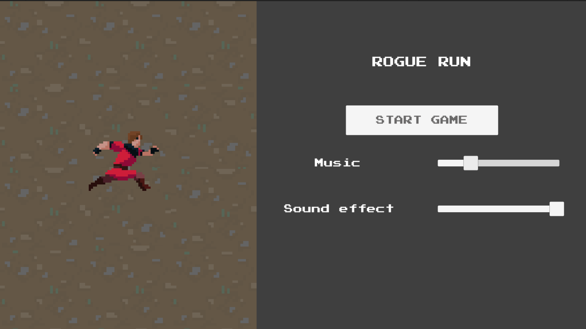
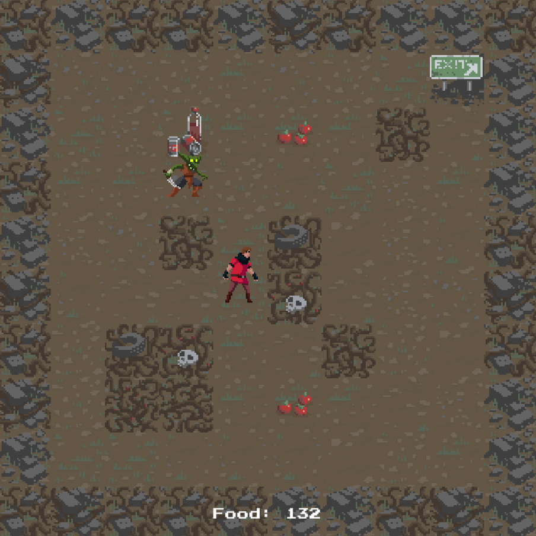
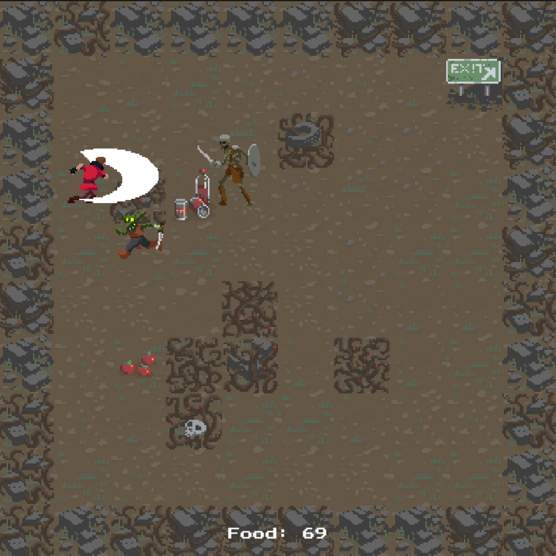

# Rogue run
## Main menu

## Gameplay
 

Trapped in a wasteland overrun by monsters, a lone survivor must navigate a treacherous underground facility, carefully managing energy while collecting food and drink to escape to safety.

# Game Features:
- Roguelike level generation.
- Use "WASD" to move.
- Each step you take costs energy, collect food and drink to gain more.
- Avoid monster on your way out.

# Game URL:
// update later...
